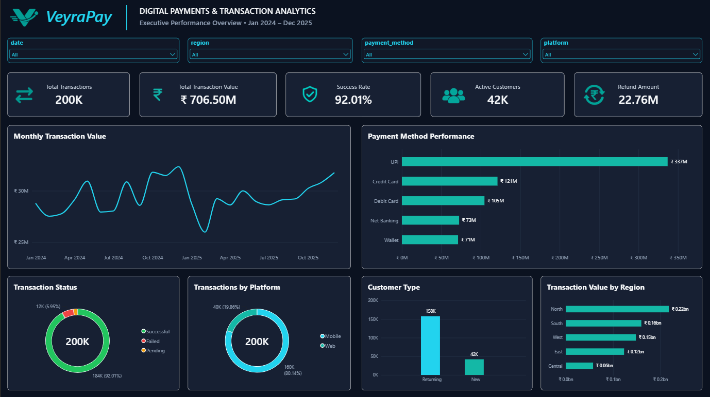

# VeyraPay — Digital Payments & Transaction Analytics

> **Smarter Payments. Better Decisions.**

## Project Overview

**VeyraPay — Digital Payments & Transaction Analytics** is an end-to-end Business Analytics / BI portfolio project built around a fictional Indian digital-payments company.

The project analyzes synthetic transaction-level data across **24 months (January 2024 to December 2025)** to understand transaction performance, payment-method behavior, customer activity, operational outcomes, refunds, platform usage, and regional performance.

**Workflow:** Synthetic Data → Excel → Python/Pandas → MySQL/SQL → Power BI/DAX → GitHub

> **Data disclosure:** VeyraPay is fictional, and the transaction dataset is synthetic. No real customer or payment records are represented.

## 📊 Dashboard Preview



## Business Problem

Payment transaction data contains information about transaction value, payment methods, transaction outcomes, customers, merchants, geography, platforms, devices, processing time, and refunds. Without a unified analytical workflow, management cannot easily evaluate transaction performance, payment reliability, customer activity, refund exposure, regional performance, and platform behavior.

## Project Objectives

- Measure transaction value and volume over time.
- Compare payment methods by volume, value, share, and success rate.
- Understand new versus returning customer activity.
- Identify transaction failures and operational patterns.
- Measure refund activity and refund value.
- Compare regional, merchant-category, and platform performance.
- Validate major KPIs consistently across Python, MySQL, and Power BI.
- Deliver a polished one-page executive Power BI dashboard.
- Document the complete analytics workflow for portfolio use.

## Key Business Questions

- What are the total transaction value and volume, and how do they trend over time?
- Which payment methods contribute the most transaction volume and value?
- How does success rate vary by payment method?
- How many active customers are there, and how do new and returning customers differ?
- What are the major transaction outcomes and failure patterns?
- How much value is refunded, and what is the refund rate?
- Which regions and merchant categories contribute the most value or volume?
- How do Mobile and Web differ in transaction performance?

## Dataset

The project uses a **synthetic transaction-level dataset** covering January 2024 through December 2025.

| Attribute | Value |
|---|---:|
| Transactions | 200,000 |
| Active Customers | 42,103 |
| Merchants | 6,000 |
| Date Range | Jan 2024 – Dec 2025 |
| Date Dimension Rows | 731 |
| Source Columns | 19 |
| Currency | INR |
| Geography | India |

### Main Transaction Fields

`transaction_id`, `transaction_datetime`, `amount`, `customer_id`, `customer_type`, `payment_method`, `transaction_status`, `failure_reason`, `merchant_id`, `merchant_category`, `state`, `region`, `city`, `platform`, `device_type`, `refund_status`, `refund_amount`, `refund_datetime`, `processing_time_seconds`

## Data Preparation

The raw generated dataset initially contained **200,160 rows**, including intentionally introduced duplicate records for data-quality testing.

The Python cleaning workflow removed duplicates, validated transaction IDs, preserved legitimate business-rule missing values, and produced a final dataset of **200,000 transactions across 19 columns with zero duplicate rows**.

## Python Analysis

Python was used for dataset generation, cleaning, exploratory data analysis, and validation.

**Tools:** Python, Pandas, NumPy

```text
generate_dataset.py
        ↓
02_data_cleaning.py
        ↓
03_eda.py
        ↓
04_validation.py
```

## MySQL / SQL Analysis

The cleaned transaction data was loaded into MySQL and organized into a dimensional model.

```text
dim_date
dim_customer
dim_merchant
dim_payment_method
dim_geography
        ↓
fact_transactions
```

The database contains **731 date records, 42,103 customers, 6,000 merchants, 5 payment methods, 85 geography records, and 200,000 fact transactions**.

### SQL Workflow

```text
01_database_setup.sql
02_data_validation.sql
03_business_analysis.sql
04_kpi_validation.sql
```

## Power BI Dashboard

The final deliverable is a **single-page executive Power BI dashboard** titled:

**DIGITAL PAYMENTS & TRANSACTION ANALYTICS**

### Dashboard Coverage

- Monthly Transaction Value
- Payment Method Performance
- Transaction Status
- Transactions by Platform
- Customer Type
- Transaction Value by Region

### Interactive Filters

- Date
- Region
- Payment Method
- Platform

The dashboard uses a custom dark executive design with cyan/teal accents and custom VeyraPay branding.

## Key KPIs

| KPI | Result |
|---|---:|
| Total Transactions | **200,000** |
| Total Transaction Value | **₹706.50M** |
| Successful Transactions | **184,024** |
| Success Rate | **92.01%** |
| Active Customers | **42,103** |
| Refund Amount | **₹22.76M** |
| Failed Transactions | **11,900** |
| Failure Rate | **5.95%** |
| Pending Transactions | **4,076** |
| Pending Rate | **2.04%** |
| Refund Transactions | **10,062** |
| Refund Rate | **5.03%** |

## Key Findings

### Strong overall transaction success

The dataset records **184,024 successful transactions**, resulting in an overall success rate of **92.01%**.

### UPI is the dominant payment method

UPI accounts for **96,088 transactions** and **₹336.84M** in transaction value, making it the largest payment method by both volume and value in the analyzed dataset.

### Payment-method reliability is closely grouped

| Payment Method | Transactions | Transaction Value | Success Rate |
|---|---:|---:|---:|
| UPI | 96,088 | ₹336.84M | 92.00% |
| Credit Card | 34,064 | ₹121.20M | 92.15% |
| Debit Card | 29,530 | ₹104.68M | 91.91% |
| Net Banking | 20,281 | ₹72.55M | 91.83% |
| Wallet | 20,037 | ₹71.23M | 92.17% |

Success rates across the five payment methods remain close to 92%, indicating no large reliability gap between methods in this synthetic dataset.

### Mobile dominates platform usage

Mobile accounts for **160,276 transactions (80.14%)**, compared with **39,724 Web transactions (19.86%)**.

### Refund activity

Total refund amount is **₹22.76M**, across **10,062 refund transactions**, representing a refund rate of **5.03%**.

## Technology Stack

| Layer | Technology |
|---|---|
| Data Generation | Python |
| Data Processing | Pandas, NumPy |
| Data Validation | Python |
| Database | MySQL |
| Querying | SQL |
| BI / Visualization | Power BI |
| Calculations | DAX |
| Version Control | GitHub |
| Documentation | Markdown |

## Project Structure

```text
VeyraPay-Digital-Payments-Analytics/
│
├── data/
│   ├── raw/
│   ├── cleaned/
│   ├── data_dictionary/
│   └── eda/
│
├── python/
│   ├── generate_dataset.py
│   ├── 02_data_cleaning.py
│   ├── 03_eda.py
│   └── 04_validation.py
│
├── sql/
│   ├── 01_database_setup.sql
│   ├── 02_data_validation.sql
│   ├── 03_business_analysis.sql
│   └── 04_kpi_validation.sql
│
├── powerbi/
│   └── VeyraPay_Digital_Payments_Analytics.pbix
│
├── screenshots/
│   └── dashboard.png
│
├── report/
│   └── VeyraPay_Project_Report.pdf
│
├── README.md
└── LICENSE
```

> The project blueprint is maintained separately as the planning/reference document and is not required inside the project root.

## Validation

- Dataset integrity and duplicate checks completed.
- Python audit, cleaning, EDA, and validation completed.
- MySQL staging-to-fact loading and KPI reconciliation completed.
- Python, MySQL, and Power BI headline KPIs reconciled.
- Power BI visuals validated individually.
- Date, Region, Payment Method, and Platform filters tested successfully.

## Limitations

- The dataset is synthetic and does not represent real VeyraPay customers or real payment activity.
- Business conclusions are limited to the generated dataset.
- Observed patterns are analytical demonstrations rather than real-world market findings.
- The project focuses on descriptive and diagnostic analytics rather than predictive machine learning.

## Project Outcome

VeyraPay demonstrates an end-to-end analytics workflow connecting **Data Generation → Data Cleaning → Exploratory Analysis → SQL Modeling → Business Analysis → KPI Validation → Power BI Dashboard**.

The final result is a portfolio-ready Business Analytics / BI project demonstrating practical skills in **Python, SQL, MySQL, Power BI, DAX, data validation, dashboard design, and business insight generation**.

## Portfolio Use

This project can be presented through GitHub, a resume, LinkedIn, and a data-analytics portfolio as an end-to-end Business Analytics / BI project.

## License

This project is intended for educational and portfolio demonstration purposes. The VeyraPay company, branding, and transaction dataset are fictional/synthetic.

## 👤 Author

**Mohammad Aatique Shaikh**  
Software Developer | Data Analyst

⭐ If you like this project, consider giving it a star!